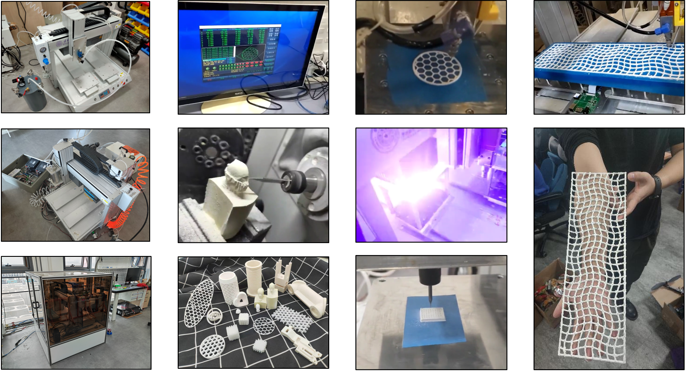

The process of additive-subtractive hybrid manufacturing in ceramics involves a combination of additive and subtractive techniques to create ceramic objects with intricate designs and high precision. Here's an overview of the process:

### Extrusion-Based Additive Manufacturing
The process begins with additive manufacturing, specifically using an extrusion-based method. In this stage, ceramic material is extruded for one layer to build up the object's shape.

### Exposure Curing
Following the extrusion process, the ceramic object undergoes exposure curing. This step involves the application of UV ligh to cure or harden the material. This is a crucial phase in ensuring the structural integrity and strength of the ceramic, as it solidifies the previously extruded layers and prepares the object for the subsequent subtractive manufacturing step.

### Milling in Subtractive 
After one or more Extrusion-Exposure process, the object is refined using subtractive manufacturing techniques such as milling. In this stage, a milling machine precisely removes excess material to achieve the desired shape and finish. This step allows for high precision and detail. It's particularly useful for achieving smooth surfaces, accurate dimensions, and specific tolerances that are essential in high-quality ceramic products.



Having the potential to combine the benefits of both additive and subtractive methods, the additive-subtractive hybrid manufacturing process is especially valuable in applications where custom or intricate ceramic components are required, such as in the medical, aerospace, and automotive industries.

